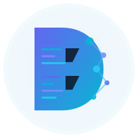

# Digimetalab - AI Automation Agency



**AI Automation for Modern Business**

A professional, modern landing page for Digimetalab, an AI Automation Agency under PT. Digital Meta Solutions.

🌐 **Live Site:** [https://digimetalab.my.id](https://digimetalab.my.id)  
🔗 **GitHub Pages:** [https://digimetalab.github.io](https://digimetalab.github.io)

---

## 📋 About

Digimetalab helps businesses accelerate productivity through intelligent automation and digital workflow innovation. We specialize in delivering smart automation solutions, digital process optimization, and innovative tools that help organizations operate faster, smarter, and more efficiently.

---

## ✨ Features

- **Modern Design** - Sleek dark theme with vibrant purple & green accents
- **Fully Responsive** - Optimized for desktop, tablet, and mobile devices
- **Smooth Animations** - Particle effects, fade-ins, counters, and parallax scrolling
- **SEO Optimized** - Proper meta tags, semantic HTML, and open graph tags
- **Fast Loading** - Lightweight vanilla JavaScript with no heavy frameworks
- **Interactive Elements** - Sticky navbar, mobile menu, smooth scrolling
- **Contact Form** - Professional inquiry form with validation
- **FAQ Accordion** - Interactive Q&A section
- **Testimonials** - Client reviews with star ratings
- **WhatsApp Integration** - Floating button for instant messaging
- **Lead Generation** - Multiple conversion points throughout the page
- **Google Analytics** - Comprehensive tracking and event monitoring

---

## 🎨 Design Highlights

### Color Palette
- **Dark Background:** `#0A0A0F`
- **Darker Layer:** `#050508`
- **Main Text:** `#FFFFFF`
- **Secondary Text:** `#B8B8C8`
- **Purple (Primary):** `#8B5CF6` (Vibrant Purple)
- **Purple Light:** `#A78BFA`
- **Purple Dark:** `#6D28D9`
- **Green (Accent):** `#10B981` (Emerald Green)
- **Green Light:** `#34D399`
- **Green Dark:** `#059669`

### Typography
- **Headings:** Poppins (600, 700, 800)
- **Body:** Inter (300, 400, 500, 600, 700)

---

## 📂 Project Structure

```
digimetalab.github.io/
├── assets/
│   └── img/
│       ├── favicon.svg          # Browser favicon
│       ├── logo.svg             # Main logo (200x200)
│       └── logo-light.svg       # Navbar logo (150x40)
├── index.html                   # Main HTML file
├── style.css                    # Stylesheet
├── script.js                    # JavaScript functionality
└── README.md                    # Documentation
```

---

## 🚀 Sections

1. **Navigation Bar** - Sticky navbar with smooth scroll
2. **Hero Section** - Full-screen with particle animation
3. **About** - Company overview and statistics
4. **Services** - 6 core service offerings
5. **Process** - 4-step methodology (Discover, Analyze, Build, Deploy)
6. **Technologies** - Featured tech stack
7. **Use Cases** - Real-world implementation examples with metrics
8. **Testimonials** - Client success stories and reviews
9. **Why Choose Us** - Key differentiators
10. **FAQ** - Frequently asked questions with accordion
11. **Contact Form** - Professional inquiry form with benefits
12. **Footer** - Company info and social links
13. **WhatsApp Button** - Floating contact button

---

## 🛠️ Technologies Used

- **HTML5** - Semantic markup
- **CSS3** - Modern styling with CSS Grid & Flexbox
- **Vanilla JavaScript** - No frameworks, pure JS
- **Canvas API** - Particle animation effects
- **Intersection Observer API** - Scroll animations
- **Google Fonts** - Poppins & Inter
- **Google Analytics 4** - User behavior tracking and analytics

---

## 📦 Installation & Setup

### Local Development

1. **Clone the repository:**
   ```bash
   git clone https://github.com/digimetalab/digimetalab.github.io.git
   cd digimetalab.github.io
   ```

2. **Open with a local server:**
   
   Using Python:
   ```bash
   python -m http.server 8000
   ```
   
   Using Node.js:
   ```bash
   npx serve
   ```
   
   Or simply open `index.html` in your browser.

3. **View in browser:**
   ```
   http://localhost:8000
   ```

---

## 🌐 Deployment

This site is automatically deployed via **GitHub Pages**.

### Deploy Steps:
1. Push changes to the `main` branch
2. GitHub Pages automatically builds and deploys
3. Site is live at: https://digimetalab.github.io
4. Custom domain: https://digimetalab.my.id

### Manual Deployment:
```bash
git add .
git commit -m "Update website"
git push origin main
```

---

## 🎯 Key Features Breakdown

### Particle Animation
- Canvas-based particle system in hero section
- 80 animated particles with connection lines
- Responsive to screen size

### Scroll Animations
- Intersection Observer for fade-in effects
- Parallax scrolling on hero section
- Smooth scroll navigation

### Interactive Elements
- Animated statistics counters
- Hover effects on cards
- Mobile-responsive hamburger menu
- Sticky navigation with scroll detection

---

## 📱 Browser Support

- ✅ Chrome (latest)
- ✅ Firefox (latest)
- ✅ Safari (latest)
- ✅ Edge (latest)
- ✅ Mobile browsers (iOS Safari, Chrome Mobile)

---

## 🔧 Customization

### Update Colors
Edit CSS variables in `style.css`:
```css
:root {
    --dark-bg: #0A0A0F;
    --purple: #8B5CF6;
    --green: #10B981;
    --glow-purple: rgba(139, 92, 246, 0.4);
    --glow-green: rgba(16, 185, 129, 0.4);
}
```

### Update Content
Edit text directly in `index.html` sections.

### Update Logo
Replace files in `assets/img/`:
- `favicon.svg` - Browser icon
- `logo.svg` - Main logo
- `logo-light.svg` - Navbar logo

---

## 📧 Contact

**PT. Digital Meta Solutions**

- 🌐 Website: [https://digimetalab.my.id](https://digimetalab.my.id)
- 📧 Email: contact@digimetalab.my.id
- 📧 Info: info@digimetalab.my.id

---

## 📄 License

© 2024 PT. Digital Meta Solutions. All rights reserved.

---

## 🤝 Contributing

This is a company website. For inquiries about contributions or partnerships, please contact us via email.

---

## 📝 Changelog

### Version 1.3.0 (2024)
- ✅ Added Google Analytics 4 integration
- ✅ Implemented comprehensive event tracking
- ✅ Enhanced Featured Technologies section
- ✅ Added scroll depth tracking
- ✅ Added interaction analytics

### Version 1.2.0 (2024)
- ✅ Added professional contact form
- ✅ Added testimonials section
- ✅ Added FAQ accordion
- ✅ Added WhatsApp floating button
- ✅ Enhanced use cases with metrics
- ✅ Improved conversion optimization

### Version 1.1.0 (2024)
- ✅ Updated to vibrant purple & green theme
- ✅ Enhanced glow effects and animations
- ✅ Updated logos and branding
- ✅ Custom domain integration

### Version 1.0.0 (2024)
- ✅ Initial release
- ✅ Responsive design implementation
- ✅ Particle animation system
- ✅ All core sections completed
- ✅ SEO optimization
- ✅ Logo and favicon integration

---

**Built with ❤️ by Digimetalab Team**
